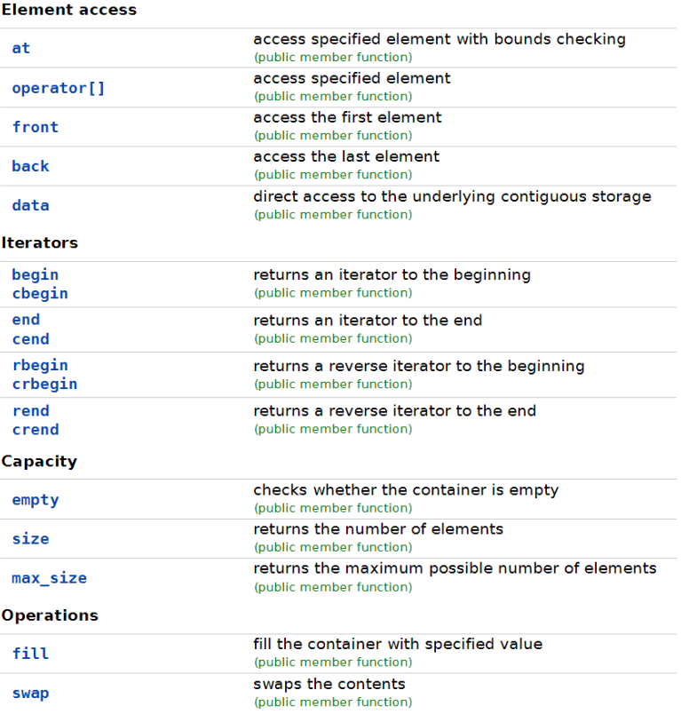

# Робота з статичними масивами
**Мета**: Створити, відлагодити та протестувати програму, у якій створити клас для обробки даних. Одним з членів класу є статичний масив структур, в якому зберігаються введені дані.

## Вказівки до роботи
Відповідно до цієї інструкції вам потрібно у середовищі Visual Studio Code з використанням набору компіляторів GCC створити програму мовою C++ з класом для обробки даних та реалізувати конструктор, деструктор, методи класу. Одним з членів класу є масив структур фіксованого розміру, в якому зберігаються введені дані. Також методи зміни полів класу повинні перевіряти валідність заданих змінних. Потрібно реалізувати проєкт у середовищі Visual Studio Code для створення багатофайлових програм.
1. Ознайомитися із властивостями контейнера `std::array` та його методами. Обдумати способи його використання для створення програм.
2. Вибрати завдання згідно свого варіанту у ДОДАТКУ.
3. Розробити блок-схему алгоритму програми.
4. Реалізувати програму для виводу даних полів (членів) масиву структур вкладених у клас.

## Короткі відомості
Введений в стандарт C++11, `std::array` — це фіксований масив, який не конвертується у вказівник при передачі в функцію. `std::array` визначається в заголовковому файлі `array`. Цей контейнер входить до Standard Template Library (STL) і надає набір методів для управління даними. Оголошення змінної `std::array` відбувається таким чином:
```c++
#include <array>
std::array<int, 4> myarray; // масив типу int довжиною 4
```
Подібно звичайним фіксованим масивам, довжина `std::array` повинна бути встановлена під час компіляції. `std::array` можна ініціалізувати за допомогою списку ініціалізаторів або uniform-ініціалізації:
```c++
std::array<int, 4> myarray = { 0 };
std::array<int, 4> myarray1 = { 8, 6, 4, 1 }; 
std::array<int, 4> myarray2 { 8, 6, 4, 1 };
```
На відміну від стандартних фіксованих масивів, в std::array ви не можете пропустити (не вказувати) довжину масиву. Доступ до значень масиву через оператор індексу здійснюється як зазвичай. Як і в стандартних фіксованих масивах, оператор індексу `[]` не виконує ніяких перевірок на діапазон. Якщо вказано некоректний індекс, то відбудуться погані речі.
`std::array` підтримує ще одну форму доступу до елементів масиву — функція `at()`, яка здійснює перевірку діапазону:
```c++
std::array<int, 4> myarray { 8, 6, 4, 1 };
myarray.at(1) = 7; // елемент масиву під номером 1 - коректний, присвоюємо йому значення 7.
myarray.at(8) = 15; // елемент масиву під номером 8 - некоректний, отримуємо помилку.
```
У прикладі, наведеному вище, виклик `myarray.at(1)` перевіряє, чи є елемент масиву під номером 1, і, оскільки він є, повертається посилання на цей елемент. Потім ми присвоюємо йому значення 7. Проте, виклик `myarray.at(8)` не спрацьовує, так як елементу під номером 8 у масиві немає. Замість повернення посилання, функція `at()` видає помилку, яка завершує роботу програми (насправді генерується виняток типу `std::out_of_range`). Оскільки перевірка діапазону виконується, то функція `at()` працює повільніше (але безпечніше), ніж оператор індексу `[]`. `std::array` автоматично робить очистку після себе, коли виходить з 
області видимості, тому немає необхідності прописувати це вручну.
Також зверніть увагу на те, що ми передаємо `std::array` по  константному посиланню. Це робиться для того, щоб компілятор не   виконував копіювання масиву при передачі в функцію. Завжди передавайте `std::array` в функцію по звичайному або константному   посиланню.  Оскільки довжина масиву завжди відома, то цикли `foreach` також можна використовувати з `std::array`:
```c++
#include <iostream>
#include <array>
 
void printLength(const std::array<double, 4> &myarray)
{
    std::cout << "length: " << myarray.size();
}

int main()
{
    std::array<double, 4> myarray { 8.0, 6.4, 4.3, 1.9 };
    printLength(myarray);
    return 0;
}
```
Детальніше про контейнер `std::array` можна дізнатися із онлайн довідника [std::array - cppreference.com](https://en.cppreference.com/w/cpp/container/array)



### Хід роботи:
Рекомендації до роботи:
1. продумайте, які типи змінних вам потрібно використати для виконання завдання.
2. створіть проєкт із кількома файлами, тобто крім основного файлу, наприклад main.cpp, додайте два файли, наприклад `student.h` та `student.cpp`. Для цього потрібно виправити файл `..\.vscode\tasks.json`, а саме замість відносного шляху до виконуваного файла `"${file}"` вказати відносний шлях директорії проєкту до всіх файлів `/*.cpp`, `/*.h`, наприклад `"${workspaceFolder}/*.cpp","${workspaceFolder}/*.h"`:
```json
{
    "version": "2.0.0",
    "tasks": [
        {
            "type": "cppbuild",
            "label": "C/C++: g++.exe build active file",
            "command": "C:\\msys64\\ucrt64\\bin\\g++.exe",
            "args": [
                "-fdiagnostics-color=always",
                "-g",
                "${workspaceFolder}/*.cpp",
                "${workspaceFolder}/*.h",
                "-o",
                "${fileDirname}\\${fileBasenameNoExtension}.exe"
            ],
            "options": {
                "cwd": "${fileDirname}"
            },
            "problemMatcher": [
                "$gcc"
            ],
            "group": {
                "kind": "build",
                "isDefault": true
            },
            "detail": "compiler: C:\\msys64\\ucrt64\\bin\\g++.exe"
        }
    ]
}
```
3. У заголовному файлі `*.h` оголосіть клас:
```c++
class Student {
    private:
    std::array<student_s_t, SIZE> students; 
    …
}
```
4. оголосіть відповідну структуру, наприклад `student_s_t`, перед оголошенням класу:
```c++
struct student_s_t {
    int id;
    std::string name;
    int course;
};
```
5. реалізуйте для класу конструктор та деструктор.
6. реалізуйте методи класу для введення і виведення даних.
7. методи зміни полів класу повинні перевіряти валідність заданих змінних і попереджувати користувача про некоректні значення.
8. можете збільшити кількість членів класу додатковими полями чи методами.
9. програма має вивести на консоль (термінал) вхідні дані та результат виконання.

### Оформлення звіту
У звіті студент має вказати свій варіант індивідуального завдання та представити:
1. Блок-схему алгоритму програми.
2. Код (лістинг) програми.
3. Результати тестування для різних вхідних умов.
4. Конструктивний висновок — що ви дізналися нового, чого навчилися, якими способами та інструментами досягнули мети.

## ДОДАТОК

### Варіанти завдань

|  № |    Клас    |                          Поля класу                        |
|----|------------|------------------------------------------------------------|
|  1 | Студент    | Ім'я, курс, середній бал                                   |
|  2 | Службовець | Ім'я, вік, посада                                          |
|  3 | Іспит      | Ім'я студента, номер білета, оцінка                        |
|  4 | Адреса     | Ім'я, вулиця, номер будинку                                |
|  5 | Товар      | Назва, ціна, кількість                                     |
|  6 | Деталь     | Назва, артикул, ціна                                       |
|  7 | Книга      | Назва, автор, ціна                                         |
|  8 | Фільм      | Назва, режисер, рік виходу                                 |
|  9 | Робітник   | Ім’я, розряд, стаж роботи                                  |
| 10 | Квитанція  | Номер, дата, сума до сплати                                |
| 11 | Автомобіль | Марка, модель, рік випуску                                 |
| 12 | Країна     | Назва, площа, кількість населення                          |
| 13 | Компанія   | Назва, керівник, кількість працівників                     |
| 14 | Судно      | Назва, тип, водотоннажність                                |
| 15 | Тварина    | Назва, ряд, родина                                         |
| 16 | Літак      | Країна, призначення, статус експлуатації                   |
| 17 | Вантажівка | Марка, потужність двигуна, вантажопідйомність              |
| 18 | Авіалайнер | Авіалінії, виробник, кількість пасажирів                   |
| 19 | Команда    | Місто, рік заснування, тренер                              |
| 20 | Квиток     | Дата, вагон, місце                                         |
| 21 | Мова       | Група, система письма, кількість літер                     |
| 22 | Ноутбук    | Виробник, розмір діагоналі екрана, процесор                |
| 23 | Бокс       | Рік, переможець, переможений                               |
| 24 | Столиця    | Країна, кількість населення, площа                         |
| 25 | Стадіон    | Місто, команда, кількість місць                            |
| 26 | Поїзд      | Номер, пункт відправлення, пункт призначення               |
| 27 | Смартфон   | Модель, об’єм оперативної пам’яті, об’єм постійної пам’яті |
| 28 | Гонка      | Рік, пілот-переможець, команда-переможець                  |
| 29 | Річка      | Назва, довжина, площа басейну                              |
| 30 | Персона    | Ім’я, дата народження, вид діяльності                      |
